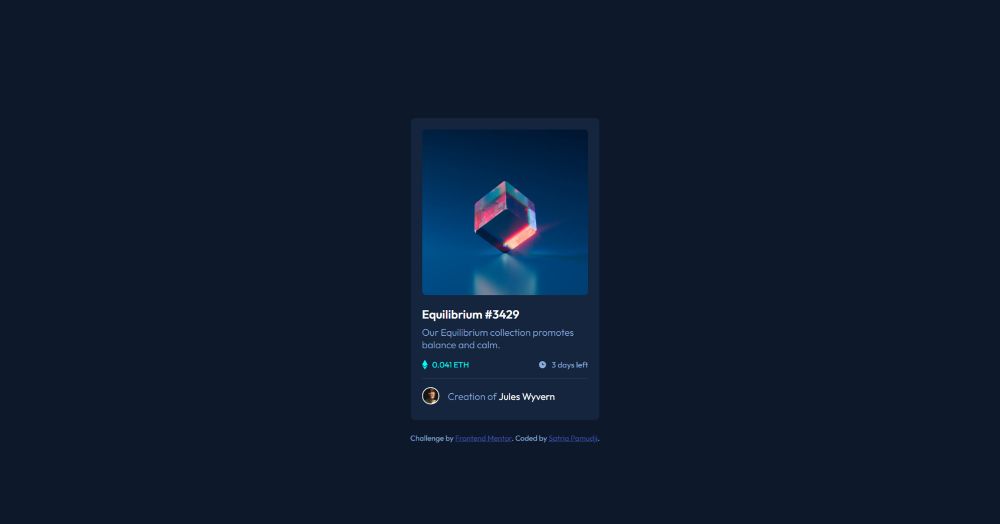

# Frontend Mentor: NFT Preview Card Component

## Overview

[NFT Preview Card Component](https://www.frontendmentor.io/challenges/nft-preview-card-component-SbdUL_w0U/hub)

In this challenge, we had to create a NFT preview card component to make it look at close as the given images.

For this project, I built it with these:

- Semantic HTML5 Markup
- CSS custom properties
- Flexbox

### What I learned

This project taught me about positioning and proper nesting. One of the issues I faced with this challenge was the fact that trying to center the elements for different breakpoints required different solutions.

1. For the web solution, I used a container as it was the easiest, while for the mobile, I used flexbox to center the card.

### Links

- Live Site URL: [NFT Preview Card Component](https://your-live-site-url.com)
- View my other challenges here: [Main Repository](#)
